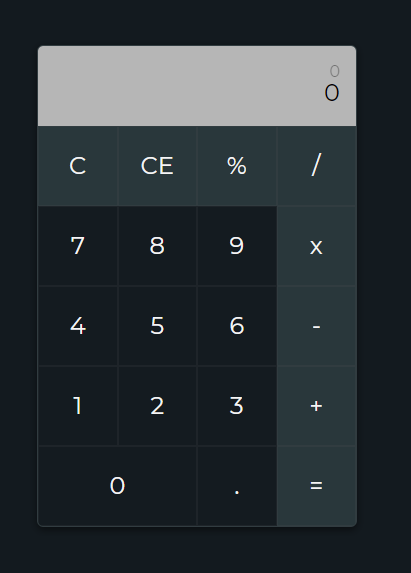

A fully functional calculator made with HTML, CSS, and JavaScript utilizing primarily Flexbox. (the percent sign functions as a modulo operator and does not calculate percentage but rather the remainder of a division.)

## Screenshot

    

## License
[MIT](https://choosealicense.com/licenses/mit/).